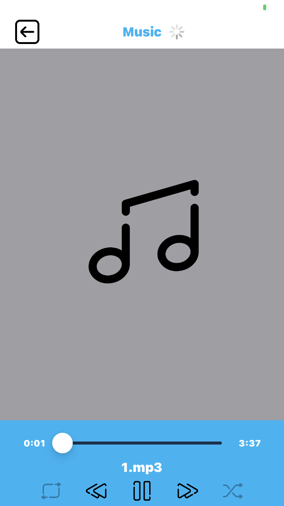

# IRMusicPlayer-swift 

- IRMusicPlayer-swift is a powerful music player for iOS.
- The Objc version [IRMusicPlayer](https://github.com/irons163/IRMusicPlayer).

## Features
- Support online/local play.
- Support to show music cover.
- Support randon mode.
- Support repeat modes: repeat all musics once, repeat current music forever, repeat all musics forever.

## Future
- Support background play.

## Install
### Git
- Git clone this project.
- Copy this project into your own project.
- Add the .xcodeproj into you  project and link it as embed framework.
#### Options
- You can remove the `demo` and `ScreenShots` folder.

### Cocoapods
- Add `pod 'IRMusicPlayer-swift'`  in the `Podfile`
- `pod install`

## Usage

### Basic
```swift
import IRMusicPlayer_swift

let xibBundle: Bundle = Bundle.init(for: MusicPlayerViewController.self)
let vc: MusicPlayerViewController = MusicPlayerViewController.init(nibName: "MusicPlayerViewController", bundle: xibBundle)

vc.musicListArray.add(NSDictionary.init(object: Bundle.main.path(forResource: "1", ofType: "mp3")!, forKey: "musicAddress" as NSCopying))

vc.musicListArray.add(NSDictionary.init(object: Bundle.main.path(forResource: "2", ofType: "mp3")!, forKey: "musicAddress" as NSCopying))

vc.musicListArray.add(NSDictionary.init(object: Bundle.main.path(forResource: "3", ofType: "mp3")!, forKey: "musicAddress" as NSCopying))

vc.modalPresentationStyle = .fullScreen
self.present(vc, animated: true, completion: nil)
```

### Advanced settings
- Use `MusicPlayerViewCallBackDelegate`.
```swift
public protocol MusicPlayerViewCallBackDelegate: NSObjectProtocol {
    func didMusicChange(path: NSString);
}
```

- Set `musicIndex` to controll which you want to play.
```swift
musicPlayerVC.musicIndex = 1
musicPlayerVC.doPlay()
```

- Make your custome music cover image.
```swift
musicPlayerVC.coverView.image = <Csutom image>
```

## Screenshots

